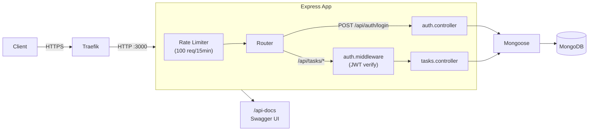

@~/.claude/prompts/new_functionality_prompt_spec.md

# Add Architecture Diagram to README

## Role
Act as a Software Architect. You are an expert in system documentation, ASCII diagrams, and Mermaid diagram syntax.

## Context
Project: `1-1-200-api-tareas-express` — Express.js + MongoDB task management REST API.  
Location: `D:\Master-IA-Dev\01-Bloque01\1-1-200-api-tareas-express`  
Non-compliant item: `dc_diagrama_arquitectura` (Notable — Documentation)  
Issue: The README describes the architecture in text ("MVC", "middleware chain", "factory/app separation") but has no visual diagram. Evaluators require a diagram showing components and data flows.

Architecture to represent:
- **Client** → HTTP request → **Traefik** (reverse proxy, TLS termination) → **Express App** (port 3000)
- Inside Express: Rate Limiter → Router → Auth Middleware → Controller → Mongoose Model → **MongoDB**
- Swagger UI at `/api-docs`
- Two route groups: `/api/auth` (public) and `/api/tasks` (protected by JWT middleware)

## Task
Add a Mermaid architecture diagram to `README.md` in a new `## Architecture` section placed after the existing "Design Patterns / Architecture" section. The diagram must show the main components, layers, and request flow.

### Architecture Diagram Guidelines
- Use Mermaid `flowchart LR` or `graph TD` syntax — GitHub and GitLab both render Mermaid natively
- Show: Client → Traefik → Express (rate limiter → router → middleware → controller → mongoose → MongoDB)
- Show two parallel paths: auth route (no JWT check) and tasks routes (JWT required)
- Keep the diagram readable — avoid excessive detail; 10-15 nodes maximum
- Place the diagram inside a ` ```mermaid ``` ` code block in the README

## Output Format
Updated `README.md` with a new `## Architecture` section containing a Mermaid diagram.

## Examples and Steps to Follow

Example Mermaid diagram structure:


1. Open `README.md`
2. Add a `## Architecture` section after the existing "Design Patterns / Architecture" section
3. Insert the Mermaid diagram block
4. Verify the diagram renders correctly on GitHub (push to a branch and preview)
5. Commit: `docs: add Mermaid architecture diagram to README`

## Output Checklist and Guardrails
- [ ] Mermaid diagram is inside a ` ```mermaid ``` ` fenced code block
- [ ] Diagram shows at minimum: Client → Express → MongoDB path
- [ ] JWT middleware path is distinct from the auth (public) path
- [ ] Diagram renders correctly on github.com (verify visually)
- [ ] No existing README content is removed or altered
- [ ] Committed and pushed to GitHub
